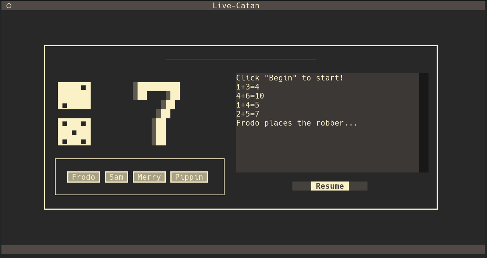

# Live Catan

A simple TUI tool to support the play of **Live Catan**.



Live Catan is a modification to the boardgame Settlers of Catan, where each player takes their turns simultaneously, and the dice are rolled every 20 seconds. (If a seven is rolled, the dice are not rolled again until the robber is placed, allowing time to catch your breath.)

I've found this to be more fun than the base game, as it avoids the problem of trades taking a long time to resolve if the players are picky. Games of Live Catan take about **15-20 minutes** rather than over an hour, and are often much less annoying!

## Usage

```bash
$ pip install -r requirements.txt
$ python3 catan.py Frodo Sam Merry Pippin
```

Changing the duration of each turn from the default of 20 seconds:
```bash
$ python3 catan.py -d 45 Luke Leia Han Chewie
```

Quit with `Ctrl+Q`.